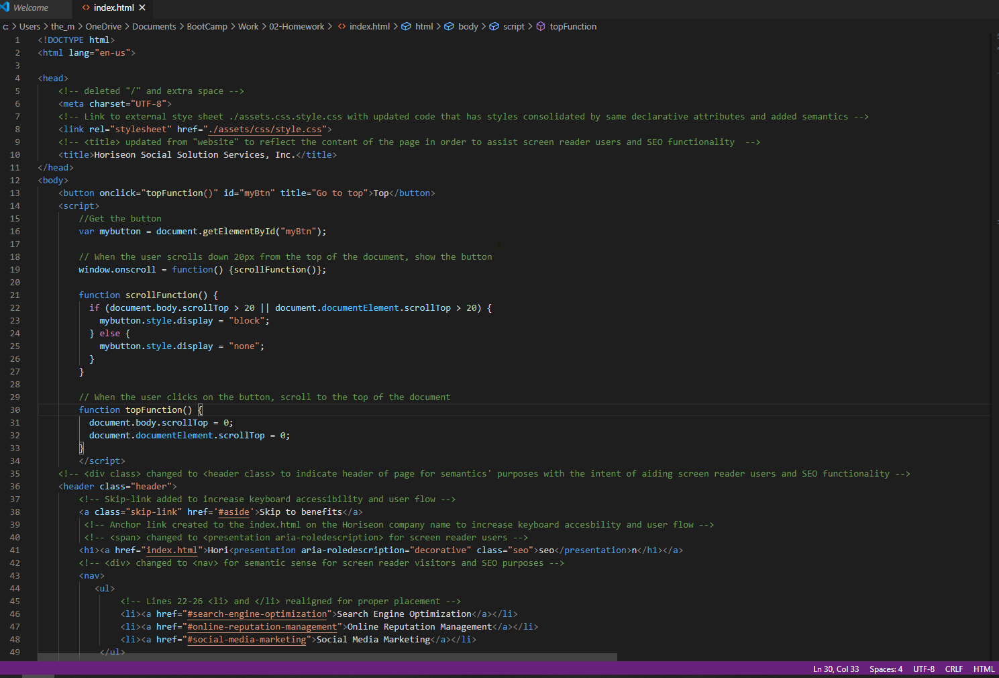

# Horiseon - Accessibility & SEO Optimization Refactor

## Overview

Horiseon Social Services, a marketing agency specializing in SEO, had an existing website that they were committed to updating in order to increase their accesssibility features for their visitors' user experiences and expand SEO optimization.

## Client's Needs/Expectations

Horiseon established that the following needs/expecations must be met:

- The source code must have HTML elements containing semantic elements to meet accessbility standards.
- The structure of the HTML elements follow a logical structure independent of styling and posiitoning.
- All image elements need their accessible alt attributes.
- Heading attributes are required to fall in sequential order.
- An updated title element that is concise and descriptive.

## Accessibility & Optimized SEO Guideline Research - Update Critieria Established

Through online reasearch of accesbility guidelines and SEO optimization, the following update criteria were established:

1. All HTML and CSS elements have proper semantaics for screen reader users and SEO optimization.
2. UI controls updated for screen readers and keyboard only controls.
3. Alt image elements that are concise and descriptive are included.
4. Skip link available to navigate by switch control, voice command, or mouth sticks/head wands.
5. For visibility, text color should be in high contrast to the background color.

## Overal Findings - Updates Made

- HTML and CSS elements EW updated to:
  - consolidate similar declarative elements
  - fix any incorrect coding , i.e. HTML Line 60 <class="search-engine-optimation"> added to fix header nav link and CSS styling
- Title is updated from "title" to "Horiseon Social Solution Services, Inc." to reflect the content of the page, assist screen reader users, and improve SEO functionality.
- "Scroll to the Top" button and Skip link included to increase keyboard accessibility and user flow.
- Anchor link created to the index.html on the Horiseon company name so users can easily return to main page.
- Div section and classes updated to applicable semantic sections, i.e. nav, header, etc, to increase screen reader users' experience and SEO optimization.
- Span changed to presentation aria roledescripton for screen reader users.
- Div class hero expanded to div role="img" and title added for screen reader visitors and SEO purposes.
- Alt image elements added with concise descriptions.
- Copyright updated to 2020 to conicide with the website's relaunch with accessibility and SEO optimization enhancements.
- Updated background color from #d9dcd6 to #ffffff for a higher contrast to assist people with low contrast sensitivity or color blindness.

## Deployed Optimized Website and Final HTML and CSS Codes

\*[Deployed website](https://kay0s.github.io/)

\*[GitHub Repository](https://github.com/Kay0s/Kay0s.github.io)

## Research Resources

- [MDN web docs - Learn Accessibility](https://developer.mozilla.org/en-US/docs/Learn/Accessibility)
- [W3.org - Web Design Accessibility](https://www.w3.org/standards/webdesign/accessibility)
- [WebAim - Web Accesbility in Mind](https://webaim.org/)
- [w3schools.com - Code for "Scroll to Top" Button](https://www.w3schools.com/howto/howto_js_scroll_to_top.asp)
- [CSS-TRICKS.com - Code for Skip link](https://css-tricks.com/how-to-create-a-skip-to-content-link/)

© 2020 Kristina Hamilton and Trilogy Education Services, a 2U, Inc. brand. All Rights Reserved.
